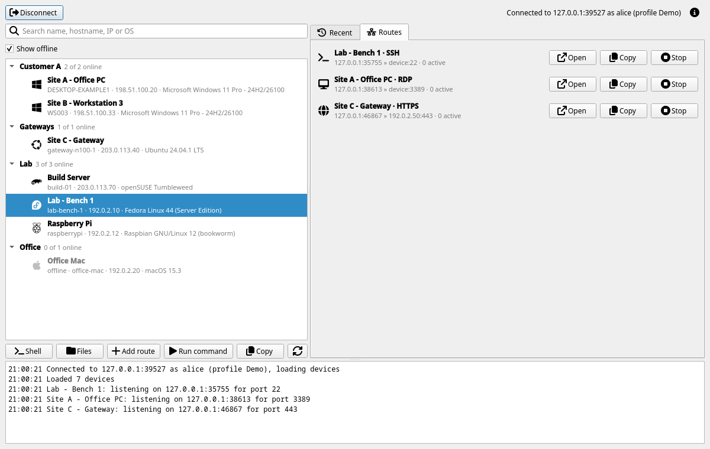
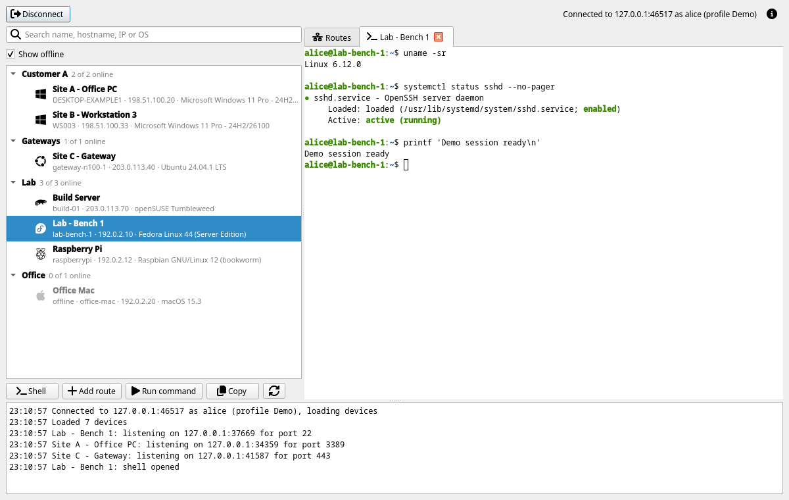

# MeshCentral Client

Simple client for [MeshCentral](https://github.com/Ylianst/MeshCentral) using the WebSocket API. Not affiliated with MeshCentral.

## Features

* List/search devices
* TCP port forwarding (Meshrouter replacement)
* SSH connections with proxy mode support
* Direct shell access (cmd/powershell/bash)
* Run a command on a node, fire and forget
* File management: list, upload, download, copy, move, delete
* Multi-profile management
* Secure password storage (OS keyring)
* Cross-platform (Windows, Linux, macOS)
* Optional desktop GUI (`mcc-gui`) with multiple simultaneous routes

## Installation
```bash
# Build current platform
make build

# Build all platforms
make build-all

# Or build directly
go build -o mcc
```

### GUI

`mcc-gui` uses the same profiles and keyring as the CLI. Log in, pick a device, and add as many routes as needed, each can be stopped on its own. Double-click a device (or use **Shell**) to open an interactive shell in a tab, with a PowerShell option for Windows devices. **Files** opens a tab browsing the device's files: upload (or drop files on the list), download, rename, delete and create folders, with transfers on a channel of their own so browsing never waits for them. Double-click a text file to edit it in its own window; saving writes it in place, so it keeps its owner and permissions, and asks first if the file changed on the device since it was opened. A route's **Open** starts the matching client: the browser for web ports, `ssh` in a terminal window for SSH, and for RDP `mstsc` on Windows or the app registered for `rdp://` links on macOS (Microsoft's Windows App) and Linux (Remmina, KRDC, GNOME Connections). **Copy** gives the device's node ID for the CLI, or a ready-made `~/.ssh/config` block with the `mcc ssh --proxy` ProxyCommand for ssh and VSCode Remote-SSH. Shell tabs and routes are marked when the server records the session. The GUI opens with the profile last connected to, leaving the CLI's default profile as it is, and routes still running at a disconnect or quit reopen on the next connect with that profile, on the same local ports.

Devices and port routes, connected to the local dummy server with fictional data:

<picture>
  <source media="(prefers-color-scheme: dark)" srcset="docs/screenshots/dark.png">
  
</picture>

An integrated terminal receiving sample output through the dummy server's shell relay:

<picture>
  <source media="(prefers-color-scheme: dark)" srcset="docs/screenshots/dark-shell.png">
  
</picture>

The GUI uses Qt 6 through miqt and needs cgo and a C++ compiler. For a native build, install the Qt 6 development packages (`qt6-qtbase-devel` on Fedora or `qt6-base-dev` on Debian/Ubuntu):

```bash
make gui          # dist/mcc-gui, linked against the system Qt
make gui-test     # GUI tests using Qt's offscreen platform
make gui-shots    # Start a dummy server and capture both themes in dist/shots
make gui-readme-shots # Regenerate the four README images in docs/screenshots
```

Screenshot generation runs offscreen on Linux using the GUI test binary and `tools/guibench`'s local dummy server. It uses temporary preferences and a mock keyring, exercises login, device queries, a shell relay and a files channel, and waits for the device list, terminal output and file listing before saving PNGs. No real MeshCentral account, credentials, or desktop session is needed. The images show fictional devices and documentation IP addresses; local server and route ports are assigned automatically.

Cross-platform builds use Podman images in `mcc-gui/package`. Images are built on first use; Windows resource generation uses `go-winres`, pinned in `tools.mod`.

```bash
make gui-linux    # dist/mcc-gui-linux-{amd64,arm64}-<version>.AppImage
make gui-windows  # dist/mcc-gui-windows-{amd64,arm64}-<version>.exe
make gui-macos    # dist/mcc-gui-darwin-{amd64,arm64}-<version>.app.zip
make gui-all      # All three platforms
make gui-release  # GUI packages for all three platforms
make release      # CLI binaries + GUI packages + sha256sums.txt
```

Linux releases are Type 2 AppImages containing Qt 6.11.3, X11 and Wayland plugins, supporting libraries, and fallback fonts. GNOME integration includes Adwaita window decorations and the GTK/GSettings backend for desktop theme preferences. Download the matching architecture, make the file executable, and run it; no Qt installation or root access is needed:

```bash
chmod +x mcc-gui-linux-amd64-<version>.AppImage
./mcc-gui-linux-amd64-<version>.AppImage
```

The supported baseline is glibc 2.39+ (for example, Ubuntu 24.04 or Debian 13) with an X11 or Wayland desktop and the host's graphics drivers. Use the amd64 build on Steam Deck in Desktop Mode; device validation is still pending. Headless servers should use the CLI. Password storage uses the desktop's Secret Service keyring; external SSH, RDP, and browser clients remain system applications.

The [current Type 2 runtime](https://github.com/AppImage/type2-runtime) embeds libfuse, so installing `libfuse2` is unnecessary. If FUSE mounting is unavailable, run `./mcc-gui-linux-amd64-<version>.AppImage --appimage-extract-and-run`. This extracts to a temporary directory and cleans it up on exit. Build tools and both architecture runtimes are checksum-pinned in `mcc-gui/package/linux.Dockerfile`; update the checksums when adopting newer upstream continuous releases.

Windows packages contain a static executable in a `.zip`. macOS packages bundle Qt in an ad-hoc signed `.app.zip` and require macOS 14 or later.

On Linux, `make gui-bench` measures CPU and memory against the dummy MeshCentral server. `make gui-soak` runs a 30-minute test with 16,000 devices and two active shells in headless Mutter. Pass `BENCH_FLAGS` for benchmark options, `SOAK` for duration, and `HIDE=` to render the window during a soak.

GUI icons are from [Font Awesome Free](https://fontawesome.com) by Fonticons, Inc., licensed under [CC BY 4.0](https://creativecommons.org/licenses/by/4.0/).

The CLI build does not link Qt and stays cgo-free.

## Usage
```bash
# Interactive device search
mcc search

# List all online devices
mcc ls

# TCP port forwarding
mcc route -L 8080:127.0.0.1:80 -i <nodeid>
mcc route -L 8080:80              # Interactive search, omit target IP
mcc route -L 80                   # Random local port
mcc route -L 0.0.0.0:8080:127.0.0.1:80 -i <nodeid>  # Listen on all local interfaces
mcc route -L '[::1]:8080:[::1]:80' -i <nodeid>      # IPv6 loopback on both ends

# SSH (interactive mode)
mcc ssh -i <nodeid>
mcc ssh user@192.168.1.1 -i <nodeid>  # SSH to network device via mesh node

# SSH proxy mode (VSCode Remote, etc.)
mcc ssh -i <nodeid> --proxy

# Direct shell access
mcc shell -i <nodeid>              # Linux/Mac: bash, Windows: cmd
mcc shell -i <nodeid> --powershell # Windows: PowerShell

# Run a command, fire and forget (no output returned)
mcc run -i <nodeid> "rename computer new-hostname"
mcc run -i <nodeid> --as-user "notify-send hello" # as logged-in user instead of SYSTEM/root

# Files (remote paths are absolute: /home/user, C:\Users)
# Leave out -i or a remote path to pick it interactively, e.g. `mcc files get`
mcc files ls -i <nodeid> /var/log         # ls with no path lists the drives on Windows
mcc files get -i <nodeid> /etc/hosts .    # several files go into a local folder
mcc files get -i <nodeid> /etc/hosts - | grep localhost
mcc files put -i <nodeid> a.txt b.txt /tmp
echo hi | mcc files put -i <nodeid> - /tmp/hi.txt
mcc files mkdir|rm [-r]|mv|cp -i <nodeid> ...  # cp copies files only, the agent can't copy folders

# Profile management
mcc profile add -n work -s mesh.company.com -u admin -p password
mcc profile list
mcc profile default work
mcc profile rm work

# View config location
mcc config
```

### Port Forward Format
```
[bind_address:]localport:target:remoteport
localport:remoteport
target:remoteport
remoteport
```

- `bind_address` - Optional, local interface to listen on, defaults to `127.0.0.1`. Use `0.0.0.0` for all IPv4 interfaces or `[::]` for all IPv6 interfaces. Only valid in the 4-part form
- `localport` - Optional, random if omitted
- `target` - Optional, host reachable from the mesh node, defaults to the node itself (`127.0.0.1`)
- `remoteport` - Required

Examples:
- `127.0.0.1:3389:127.0.0.1:3389` - Local 127.0.0.1:3389 to the node's RDP port
- `0.0.0.0:8080:192.168.1.1:80` - Local 8080 on all interfaces to 192.168.1.1:80 via the node
- `8080:192.168.1.1:80` - Local 127.0.0.1:8080 to 192.168.1.1:80 via the node
- `8080:80` - Local 127.0.0.1:8080 to port 80 on the node
- `192.168.1.1:80` - Random local port to 192.168.1.1:80 via the node
- `80` - Random local port to port 80 on the node

Enclose IPv6 bind addresses and targets in brackets, and quote the specification to keep the shell from interpreting them:

```bash
mcc route -L '[::1]:8080:127.0.0.1:80' -i <nodeid> # Local IPv6 listener, remote IPv4 target
mcc route -L '8080:[2001:db8::10]:80' -i <nodeid>  # IPv6 target reachable from the node
mcc route -L '[2001:db8::10]:80' -i <nodeid>       # IPv6 target, random local port
mcc route -L '[::]:8080:[::1]:80' -i <nodeid>      # All local IPv6 interfaces
```

Scoped addresses such as `[fe80::1%eth0]` are accepted. A bind address's scope names a local interface; a target's scope names an interface on the mesh node. Explicit `::1` targets remain IPv6 loopback rather than falling back to the node's IPv4 default. The node must have IPv6 connectivity to the target.

For a MeshCentral server specified by IPv6 address, use `[2001:db8::1]` or `[2001:db8::1]:8443` in the profile's server field. The SSH command accepts a bare IPv6 target after the username, for example `mcc ssh 'user@2001:db8::10' -i <nodeid>`.

## Flags

### Global
- `-C, --config` - Alternate config file
- `-P, --profile` - Override active profile
- `-t, --token` - 2FA token
- `-k, --insecure` - Skip TLS certificate verification (testing only)
- `--debug` - Enable debug logging

### Command-Specific
- `-i, --nodeid` - Target device ID, with or without the `node//` prefix (omit for interactive search)
- `-L, --bind-address` - Port forward specification (route)
- `-p, --port` - SSH remote port, default 22 (ssh)
- `--proxy` - SSH proxy mode for ProxyCommand (ssh)
- `--powershell` - Use PowerShell instead of cmd.exe (shell)
- `--as-user` - Run as the logged-in user instead of SYSTEM/root (run)

## 2FA Authentication

If the MeshCentral server requires two-factor authentication, mcc handles it automatically.

**Interactive prompt** - when no token is provided, mcc will prompt after the initial connection attempt:
```
WARNING  2FA required.
Enter 2FA token: ******
```

**Inline token** - pass the token directly to skip the prompt, useful for scripting or when the token is already known:
```bash
mcc ssh -i <nodeid> --token 123456
mcc shell -i <nodeid> --token 123456
mcc route -L 8080:80 -i <nodeid> --token 123456
```

**Email/SMS tokens** - if the server supports out-of-band tokens, type `email` or `sms` at the prompt to request one, then re-enter the prompt with the received code:
```
WARNING  2FA required. Enter a token or type 'email'/'sms' to request one.
Enter 2FA token: email
WARNING  2FA required.
Enter 2FA token: 123456
```

**Remembered login** - after a successful 2FA login, mcc (and mcc-gui) asks the server for its "remember this device" cookie and stores it in the OS keyring next to the profile's password. Later logins with that profile, and reconnects after a network drop, skip the token prompt until the cookie expires (the server's `twoFactorCookieDurationDays`, 30 days by default) or is rejected, then you're prompted again. The password is still required. `mcc profile rm` deletes the cookie with the profile.

> **Note:** Node IDs containing special characters (e.g. `$`) must be wrapped in single quotes to prevent shell expansion:
> ```bash
> mcc ssh -i 'node//abc$def...'
> mcc ssh -i 'abc$def...'   # node// prefix is optional
> ```
>
> The same applies to `ProxyCommand` in `~/.ssh/config`. Use single quotes, since OpenSSH runs it through `sh -c`. Some launchers (e.g. VSCodium's open-remote-ssh) spawn it without a shell and pass the quotes through literally; mcc strips them, so single quotes work in both:
> ```
> Host my-node
>   User root
>   ProxyCommand mcc ssh -i 'node//abc$def...' --proxy
> ```

## Security

**Password Storage Migration (v1.0+)**

Passwords now stored in OS-native secure storage:
- **Linux**: Secret Service API (gnome-keyring/kwallet)
- **macOS**: Keychain
- **Windows**: Credential Manager

Existing plaintext passwords migrate automatically on first run. Config file only stores server/username.

**TLS Verification**

Use `--insecure` only for testing with self-signed certificates. Not recommended for production.

## Configuration

Default config: `~/.config/mcc/meshcentral-client.json`

Profiles store server URL, username. Passwords stored separately in system keyring.

## Development
```bash
make build        # Build current platform
make build-all    # Cross-compile all platforms
make version      # Show version info
make clean        # Remove build artifacts
```

## License

MIT License - see [LICENSE](LICENSE)
